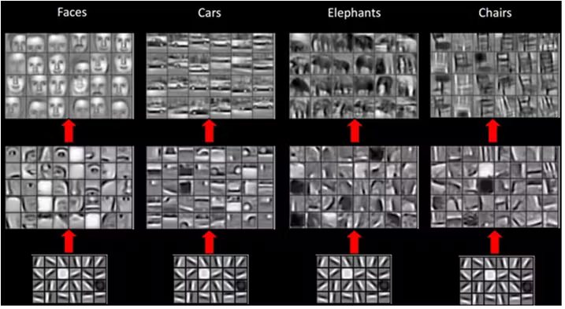

## 预训练模型应用

#### 介绍

在新媒体平台上线初期，图像数据处于不断积累的状态，特定领域的图像数据可能还不够充分。然而，为了平台能够更好地组织和推荐图像内容，图像分类是一个必要的任务。此时，从头开始训练深度学习模型可能会面临过拟合的问题。

一种常用且高效的应用于小数据集的深度学习方法就是使用预训练模型。

> 预训练模型就是之前在一个大型数据集上训练好的模型。因为数据集足够大，因此模型会具有普适性，即底层学到的特征对于大部分任务都是通用的。



对于不同类别的样本，其底层特征都是通用的

对于大型数据集，其公开可用的预训练模型也会有非常多，如在 ImageNet 数据集上的预训练模型：

| 模型名称    | 模型大小（MB） | Top-1 精度 | Top-5 精度 | 参数量 | 模型深度 |
| ----------- | -------------- | ---------- | ---------- | ------ | -------- |
| ResNet50    | 98             | 74.9%      | 92.1%      | 25.6M  | 107      |
| InceptionV3 | 92             | 77.9%      | 93.7%      | 23.9M  | 189      |
| MobileNetV2 | 14             | 71.3%      | 90.1%      | 3.5M   | 105      |
| ……          | ……             | ……         | ……         | ……     | ……       |

每个模型因为网络结构不同的原因，底层学到的特征也都是不同的。 因此在对于精度要求较高但缺少训练样本的任务中，一种常见的方案为：

1. 用使用多个预训练模型对数据进行特征提取。
2. 构建一个简单的分类模型。
3. 将多个预训练模型提取的特征向量进行拼接，对模型进行训练。
4. 最终就使用多个预训练模型+简单模型进行预测。

#### 准备

开始答题前，请确认 `/home/project` 目录下包含以下文件：

- `train_feature.zip`，可以通过 `unzip train_feature.zip` 命令解压训练数据文件，其中每个 json 文件内容格式如下：

  ```json
  {
      'id': {'feature': [0.006, ..., 0.225], 'label': 1},
      ...
  }
  ```

  - id 是样本 id。
  - feature 是由预训练模型提取的图像训练数据的特征向量，长度为 2048。
  - label 是样本对应的样本。

- `test_feature.zip`，可以通过 `unzip test_feature.zip` 命令解压测试数据文件，其中 `test.json` 文件内容格式如下：

  ```json
  {
      'id': {'feature': [0.006, ..., 0.225]},
      ...
  }
  ```

  - id 是样本 id。
  - feature 是由三个预训练模型提取的图像测试数据的特征向量的拼接结果，长度为 6144。

## 目标

请在 `task.py` 文件中编写代码，并按以下要求实现对测试数据的预测。

- 将训练数据的三个特征向量按 resnet、inception、xception 的顺序合并成长度为 6144 的向量，然后训练一个分类模型。

- 使用训练后的模型对 `test.json` 中的样本进行预测，最后在 `/home/project/` 目录下生成结果文件 `result.csv`，且预测准确率达到 95%。

  > 提示：判题过程中的准确率计算示例：真实标签为 [0, 1, 0, 1, 1]，预测标签为 [0, 1, 1, 1, 0]，准确率为 0.6，表示 60% 的样本被正确预测。

  结果示例：

  ```
  id,label
  MDAwMe,0
  MDAwMq,1
  MDAwMf,0
  MDAwMs,0
  ```

#### 规定

- 切勿修改任务中提供的所有数据，以免判题不通过。

#### 判分标准

- 实现目标，该题得 20 分；
- 未实现目标，该题得 0 分。