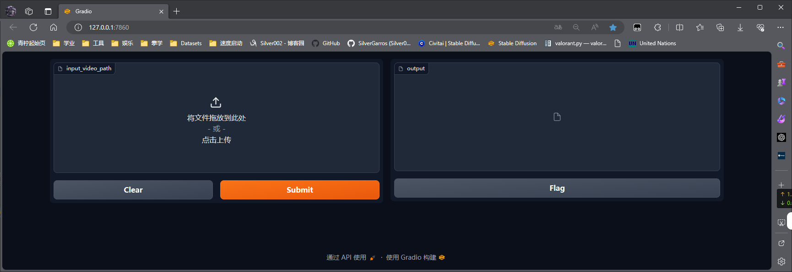

# VidDirMask

### 一个基于Whisper的视频脏话过滤自动消声程序

## 需要的环境

- python3.8+
- CUDA 11.2+
- pytorch 2.0+
- Whisper

环境的下载安装见：

使用说明，在虚拟环境下配置好whisper后，安装requirements.txt的库，然后运行app.py文件，在打开的端口网页选择视频文件，点击Submit 进行视频处理。

